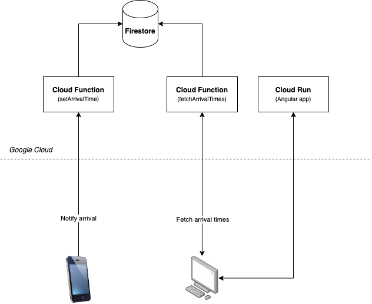

# Cloud Functions Demo

  

This project has been developed as a support for the Cloud Functions presentation.

## Goal

The objective was to build a system capable of tracking workers arrival times without them having to manually provide these each day.

## Proposed solution

The solution follows the architecture diagram below :

The first Cloud Function tries to push a new document for the day onto the Firestore.

The second Cloud Function fetches and sends all arrival times stored in the Firestore.

The Cloud Run service holds a containerized Angular application which will call the second cloud function then display results in a graph using [Chart.js](https://www.chartjs.org).

One way to automatically call the first Cloud Function could be to use [iOS Shortcuts](https://support.apple.com/guide/shortcuts/welcome/ios).